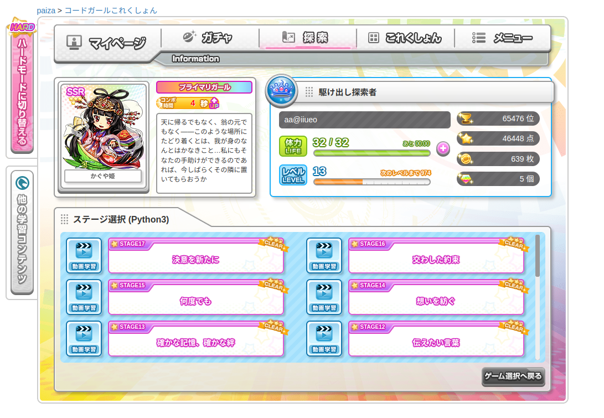

# paiza

##code girl

#恋するハッカソン

[ショートヘア](hakkason/shorthair.py)

[ロングヘア](hakkason/longhair.py)

[ポニーテール](hakkason/ponytail.py)

[ツインテール](hakkason/twintail.py)

[おさげ](hakkason/osage.py)

[たれ目](hakkason/tareme.py)

[つり目](hakkason/turime.py)

[メガネ](hakkason/megane.py)

[キュート衣装](hakkason/kyutoisyou.py)

[Sexy衣装](hakkason/sexyisyou.py)

[水着](hakkason/mizugi.py)

[マイク](hakkason/maiku.py)

[カチューシャ](hakkason/katusya.py)

# poh7_彼女をつくる

[つり目](kanojo/tsurime.py)

[眼帯](poh7/gantai.py)

[猫耳セット](poh7/nekomimi-set.py)

[猫セット](poh7/neko-set.py)

[ショートヘア](poh7/shorthair.py)

[ロングヘア](poh7/longhair.py)

[ポニーテール](poh7/ponytail.py)

[ツインテール](poh7/twintail.py)

[セーラー服](poh7/sailor-suit.py)

[カーディガン](poh7/cardigan.py)

[縞ニーソセット](poh7/shima-socks.py)

[メイド服](poh7/maid-fuku.py)
